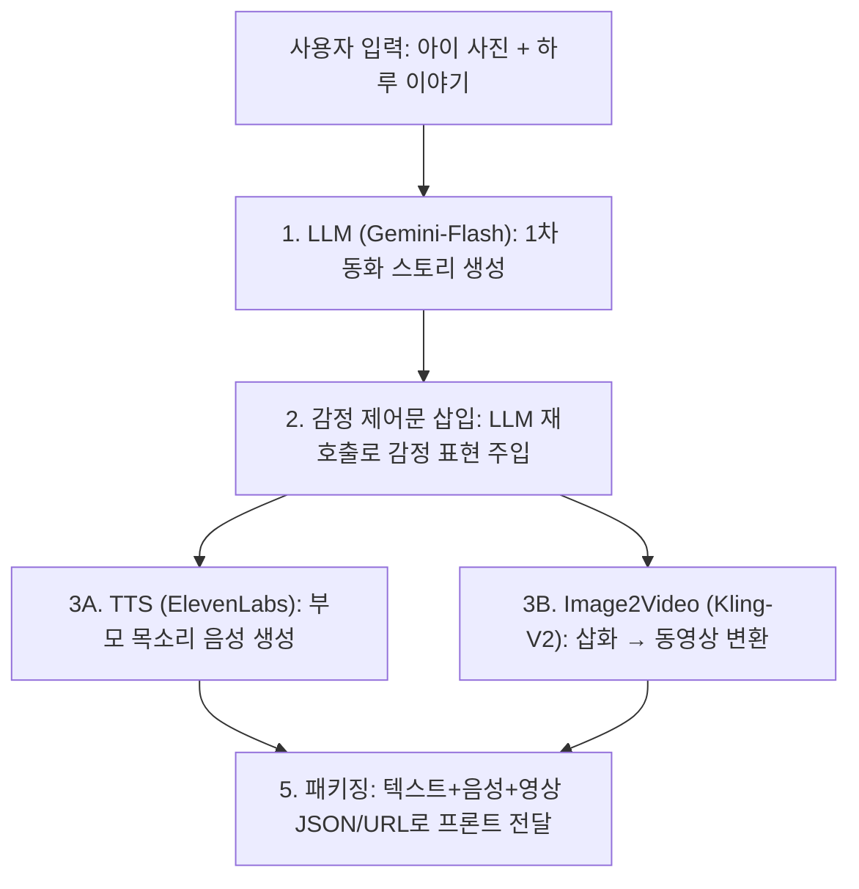

# MoriAI (모리아이)

> 우리 아이의 하루가 세상에서 가장 재미있는 영어 동화책이 됩니다.  
> 해커톤 2025 IA x AI – 팀 so42ety
 

### 시연 영상 : [유튜브 시연영상](https://www.youtube.com/watch?v=zQO2ddCXmzg)

### 서비스 데모: [서비스 링크](https://dev.crimecat.org/)

본 프로젝트는 해커톤 2025 IA x AI 출품작으로, 현재 심사위원 평가를 위해 배포 서버가 운영되고 있습니다.

원활한 심사 진행을 위해, 심사위원이 아닌 분들께서는 서버로의 직접적인 API 요청이나 과도한 트래픽 유발을 자제해 주시기를 정중히 부탁드립니다.

프로젝트에 대한 피드백이나 문의 사항은 본 저장소의 Issues 탭을 이용해 주시면 감사하겠습니다!
  
(배포 환경이 내려가 있으면 아래 "로컬에서 실행하기"를 참고하세요.)

---


## 1. 프로젝트 소개

### 문제 정의

많은 부모가 아이의 첫 영어교육으로 **영어 동화책 읽어주기(4~6세)** 를 선택하지만, 요즘 아이들은 **동적인 유튜브(시청률 93.1%)에 익숙**해서 정적인 책을 지루하게 느끼고, 결국 부모와 아이 모두에게 이 시간이 **'즐거운 놀이' → '괴로운 숙제'** 가 되는 문제가 있습니다.

### 목표

MoriAI는 이 "괴로운 숙제" 시간을 다시 **"놀고 싶어서 찾는 시간"** 으로 되돌리는 것이 목표입니다.

- 아이의 **실제 사진과 하루 이야기**로 동화를 만들고
- 생성된 동화를 **AI가 영상처럼 움직이게** 만들고
- 무엇보다 **부모 목소리를 AI로 재현**해서 읽어주도록 해서

→ 아이가 "이건 내 얘기고, 우리 엄마/아빠가 읽어주는 책"이라고 느끼게 만드는 서비스입니다.

---

## 2. 주요 기능

1. **나 자신이 주인공인 동화 생성**
    - 아이 사진 + 하루 스토리 입력 → LLM이 감정이 담긴 동화 스크립트 생성
    - 자기참조 효과(Self-reference effect)로 몰입도 향상
    - 

2. **정적인 삽화를 '움직이는 동화'로 변환**
    - 생성된 삽화 이미지를 **Kling-V2**로 동영상화
    - 시각적 집중력 유지, 지루함 최소화
    - 


3. **부모 목소리 재현 TTS**
    - ElevenLabs API로 부모 음성을 클론하여 **익숙한 목소리로 동화 낭독**
    - 뇌과학적으로 언어 발달 자극 효과 증대
    - 


4. **프론트엔드 인터랙티브 동화 뷰어**
    - React + TypeScript + TailwindCSS로 제작
    - React PageFlip으로 실제 책 넘기는 효과
    - 
    - 


---

## 3. 기술 스택

| 영역 | 사용 기술 |
|------|----------|
| **AI / Media** | Gemini-Flash (LLM), Kling-V2 (Video), ElevenLabs (Voice/TTS) |
| **Backend** | Python, FastAPI, Uvicorn, asyncio, pydub, FFmpeg |
| **Frontend** | React, TypeScript, Vite, TailwindCSS |
| **Infra & DevOps** | Docker, Docker Compose, Nginx, Cloudflare Tunnel |
| **협업** | GitHub (git-flow), Notion, Figma |

---

## 4. 프로젝트 구조

```
projectMori/
├── src/
│   ├── storybook/              # Storybook API (포트: 8001)
│   │   ├── api/                # API 스키마 (Pydantic 모델)
│   │   ├── core/               # 핵심 설정 (config, logging, middleware, DI)
│   │   ├── domain/             # 도메인 모델 (Book, Page, Dialogue)
│   │   ├── repositories/       # 데이터 저장/조회 계층 (인메모리 캐시 + 파일 백업)
│   │   ├── storage/            # 파일 시스템 관리 (이미지/비디오/음성 저장)
│   │   ├── services/           # 비즈니스 로직 계층
│   │   ├── prompts/            # LLM 프롬프트 템플릿
│   │   └── utils/              # 파일 관리 유틸리티
│   │
│   ├── tts/                    # TTS API (포트: 8000)
│   │   ├── core/               # 핵심 설정 (config, logging, middleware, registry)
│   │   ├── features/           # Feature-First 아키텍처
│   │   │   ├── health/         # 헬스 체크
│   │   │   ├── tts_generation/ # TTS 배치 생성
│   │   │   ├── word_tts/       # 단어 단위 TTS
│   │   │   ├── voice_clone/    # 클론 보이스 생성
│   │   │   └── voice_management/ # 보이스 목록 관리
│   │   ├── src/                # TtsGenerator 싱글톤 (ElevenLabs API)
│   │   ├── utils/              # 오디오 처리 (FFmpeg)
│   │   └── shared/             # 의존성 주입 (DI)
│   │
│   └── front/                  # 프론트엔드 (React + Vite)
│       ├── src/
│       │   ├── pages/          # 페이지 컴포넌트
│       │   ├── components/     # 재사용 컴포넌트
│       │   └── api/            # API 호출 함수
│       └── vite.config.ts      # Vite 설정
│
├── data/                       # 데이터 저장 디렉토리 (Docker Volume)
│   ├── book/                   # 동화책 메타데이터
│   ├── image/                  # 이미지 파일
│   ├── video/                  # 비디오 파일
│   └── sound/                  # 음성 파일
│
└── docker/                     # Docker 설정
    ├── nginx/                  # Nginx 설정
    ├── tts/                    # TTS API Dockerfile
    ├── storybook/              # Storybook API Dockerfile
    └── front/                  # Frontend Dockerfile
```

---

## 5. 동확책 생성 AI 파이프라인 개요



**세마포어 기반 동시성 제어**

Kling API는 동시에 3개의 비디오 생성만 가능하므로 `asyncio.Semaphore(3)`로 제한. 동시 요청 시 안전하게 대기열로 처리.

---

## 6. 프로젝트 핵심 기능 (API 및 오케스트레이션)

| 단계 | 역할 |
|------|------|
| **1단계 – 스토리 생성** | 아이 사진·일기를 입력받아 LLM(Gemini-Flash)으로 감정 포함 스토리 생성 |
| **2단계 – 감정 주입** | LLM 재호출로 "행복/놀람/슬픔" 등 감정 표현문 삽입 |
| **3단계 – 음성 합성 (TTS)** | ElevenLabs API 호출, 부모 음성 기반의 감정형 TTS 생성 |
| **4단계 – 비디오 생성** | 1. gemini-2.5-flash-image로 이미지 동화화, 2. Kling-V2 API 호출로 삽화 이미지를 동영상으로 변환 |
| **5단계 – 결과 패키징** | 스토리 텍스트 + 오디오 + 영상 URL 반환 |
| **오케스트레이션** | 모든 AI 모듈을 비동기 태스크로 관리, 실패 시 재시도 로직 내장 |

### 내부 처리 예시 (비동기 오케스트레이션)

```python
async def process_story(payload):
    story = await generate_story(payload)
    emotion_story = await inject_emotion(story)
    tts_task = asyncio.create_task(generate_tts(emotion_story))
    video_task = asyncio.create_task(generate_video(emotion_story))
    audio, video = await asyncio.gather(tts_task, video_task)
    return await merge_and_package(audio, video, emotion_story)
```

---

## 7. TTS API

ElevenLabs API를 래핑한 싱글톤 클래스로, TTS 생성 및 클론 보이스 관리 기능을 제공합니다.

### 주요 기능

| 메서드 | 기능 | 설명 |
|--------|------|------|
| **TTS 생성** | | |
| `generate_batch()` | TTS 배치 생성 | 중첩 리스트 구조 유지하며 각 텍스트를 음성으로 변환 (비동기 병렬 처리, 세마포어 제어) |
| `generate_word()` | 단어 단위 TTS 생성 | 특정 단어의 음성 생성 (Book별 voice_id 지원, 캐싱) |
| `_generate_single()` | 단일 TTS 생성 | ElevenLabs `text_to_dialogue` API 호출 (내부 메서드, 세마포어 제어) |
| **클론 보이스 관리** | | |
| `get_clone_voice_list()` | 클론 보이스 목록 조회 | ElevenLabs API에서 사용자 보이스 리스트 조회 (IVC/PVC 상태 자동 판별) |
| `create_clone_voice()` | 클론 보이스 생성 | 오디오 파일 → 길이 검증 → 트리밍 (필요 시) → ElevenLabs IVC API 호출 |
| `check_duplicate_voice_name()` | 이름 중복 확인 | 클론 보이스 생성 전 이름 중복 체크 |
| **오디오 처리** | | |
| `validate_audio_duration_only()` | 오디오 길이 검증 | 오디오 파일의 길이만 검증 (2분30초 이상 필요) |
| `_validate_and_process_audio()` | 오디오 검증 및 처리 | 길이 검증 + 트리밍 (3분 이상 시 2분59초로 트리밍) |
| **유틸리티** | | |
| `get_stats()` | TTS 통계 조회 | 출력 경로, 동시 요청 수, 파일 개수 등 통계 정보 반환 |
| `_save_audio_file()` | 오디오 파일 저장 | 비동기 파일 저장 (내부 메서드) |
| `_cleanup_temp_file()` | 임시 파일 삭제 | 임시 파일 정리 (내부 메서드) |

### 핵심 특징

1. **싱글톤 패턴**: 애플리케이션 전체에서 단일 인스턴스 사용
2. **세마포어 제어**: 최대 동시 요청 수 제한 (기본 5개)
3. **비동기 배치 처리**: 중첩 리스트 구조 유지하며 병렬 처리
4. **오디오 전처리**: FFmpeg 기반 길이 검증 및 자동 트리밍

---

## 8. Storybook API 주요 기능

| 메소드 | 주요 기능 | 설명 |
|--------|----------|------|
| `create_book` | 동화책 생성, `BackgroundTasks`를 통한 동화책 생성 파이프라인 비동기 실행 | 오래걸리는 동화책 생성의 리소스 점유를 방지하기 위해 background task로 비동기 실행 |
| `get_book` | 동화책 조회 | 인메모리로 캐시되어있는 동화책을 조회하여 프론트에게 반환 |
| `get_all_books` | 동화책 전체 조회 | 인메모리로 캐시되어있는 동화책 전체를 프론트에게 반환 |
| `delete_book` | 동화책 삭제 | 캐시되어있는 동화책 삭제 및 관련 파일 삭제 |

---

## 9. 페이지별 주요 기능 및 사용 방법

| 페이지 | 주요 기능 | 설명 |
|--------|----------|------|
| **책장(BookShelf)** | 서비스 소개, "내 아이 이야기로 동화 만들기" 버튼 | 사용자 진입 페이지, 생성된 책을 보여줌. FastAPI 백엔드에서 LLM/TTS/Video 작업이 비동기 처리 중 |
| **스토리 생성(Creator)** | 사진 업로드, 텍스트 입력 | 사용자가 아이의 사진과 하루 일기를 입력 |
| **동화 뷰어(Viewer)** | 생성된 동화 영상/음성 재생 | 문장 재생, 단어별 발음 듣기 기능, 인터렉티브 UI 구현 |
| **설정(Setting)** | 동화를 읽어줄 음성 등록 | 엄마, 아빠 등 다양한 목소리 등록 및 관리 |

---

## 10. 설치 & 실행

### 10.1 필수 요구사항

- Python 3.12+
- Node.js 20+
- Docker & Docker Compose
- FFmpeg 설치

### 10.2 Makefile로 실행

```bash
# 개발환경 실행 (/src/front 폴더에서 npm run dev 실행)
make dev

# 또는 프로덕션 환경 실행 (Cloudflare Tunnel로 호스팅, Nginx로 HTTP 연결)
make prod
```

---

## 11. 팀 (so42ety)

| 이름 | 역할 | 담당 |
|------|------|------|
| **이충헌** | Team Lead / PM | 프로젝트 기획·관리, 기술 총괄 |
| **변상훈** | Backend & DevOps | 인프라 설계, TTS API, Docker/Nginx |
| **이동학** | AI & Backend Lead | LLM/TTS/Video 파이프라인 설계 및 구현 |
| **이소민** | Product Designer & Frontend | UX/UI 디자인(Figma), React 인터랙션 구현 |
| **최지민** | Frontend Developer | 프론트 구조 설계, API 연동, 상태관리 |

**협업 도구**: Notion, Figma, GitHub (git-flow)

---

## 12. 라이선스

> 해커톤 산출물 기준 레포지토리입니다.  
> 대회 규정/기관 요구에 따라 공개 범위가 달라질 수 있습니다.
